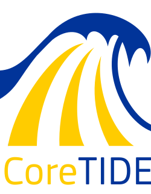

<table align="center"><tr><td align="center" width="9999">

# The first DetectionOps open platform

_Threat Informed Detection Modelling and Engineering as-Code_

Powering DIGIT S2 CATCH Detection Engineering Operations,
CoreTide is planned to go open source for the benefit of the European - and beyond - SOC community.

</td></tr></table>

**🎤 Talks**

- [Lightning Talk] Hack.lu 2023 : [TIDeMEC(CoreTIDE) : A Detection Engineering Platform Homegrown At The EC](https://www.youtube.com/watch?v=lng-87nRTGQ)
- [Slides] FIRST Technical Colloquium Amsterdam 2024 : [CoreTIDE: the First Project of the OpenTIDE Family](https://www.first.org/resources/papers/amsterdam24/Benson-Housmann-Seguy-CoreTIDE-FIRST-TC-Amsterdam-2024.pdf) 

CoreTide is a platform that has been built for the better part of the past 2 years at the EC, and builds on top of years of astute observations of what goes wrong in the detection engineering field. It is an opinionated end-to-end platform, data model, framework and solution built on top of DevOps and as-code principles, with an emphasis on traceability, consistency, safety and automation. The knowledge-graph data architecture of CoreTide scales from the input of a threat intelligence signal to the deployment of a detection rule whilst maintaining strong relations between actors, threat, detection objectives, and rules using a UUID system.

